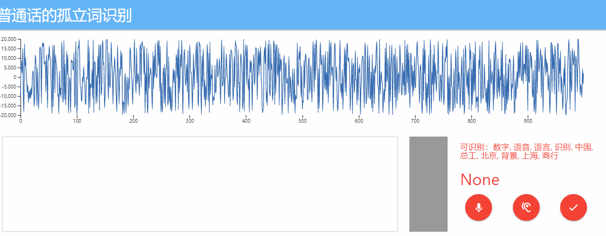

# Isolated-Words-Speech-Classification

整体项目是语音识别的课设。

## 项目说明

本项目使用pytorch库作为机器学习的框架，以flask库作为前端框架。
具体语音识别是使用的模型是VGG-11-BN。

语料库一共是由12个中文词和8个英文单词组成，但是我们的课设要求是中文的，
所以后面8个单子在识别的过程中被我删除了

识别的孤立词：
|0|1|2|3|4|5|6|7|8|9|10|11|
|-|-|-|-|-|-|-|-|-|-|-|-|
|数字|语音|语言|识别|中国|总工|北京|背景|上海|商行|复旦|饭店|

演示：

### 识别流程：

首先是前端录音，这面的工作很多包括录音，采样率的调整，音频文件格式的转码，音频的可视化，这些都有html（客户端完成），
客户端的音频文件采集完成后会以base64格式回传给服务器端，服务都端解码、以录音时间为名称保存下来这个wav文件，保存在test_data里面，
然后音频数据给到模型识别，识别后的结果再回传给客户端展示。

## 使用说明

### 环境配置

搭建环境，执行命令`pip install -r piplist.txt`
我这里的torch使用的是GPU版本，如果使用CPU版本的，可以删除后自行安装。

### 直接使用

下载我训练好的模型文件，解压放在save里，也可以自行在server.py里指定。
然后运行server.py，启动成功后访问http://127.0.0.1:8800/ 即可识别。

[Google Drive-save.ptr](https://drive.google.com/file/d/1xhjrXVtPG4KOdRq_1e_Go_5Rz_nSkk4K/view?usp=sharing)

**注意必须使用chrome浏览器打开，不然会出现图片资源加载不出。**

### 模型训练（可选）

神经网络在[DSPSpeech-20](https://github.com/zhongyuchen/DSPSpeech-20)数据集上进行训练,
数据集存放在data目录下。运行cnn_melspec.py即可开始训练。

[Google Drive-Data](https://drive.google.com/file/d/1imckOcBAdLL6-2v_A1_IbhT0-I9ioYfc/view?usp=sharing)

## 文件结构

├─cnn_melspec_log 神经网络训练时产生的日志文件用于tensorboardX可视化 
├─data 数据集存放的位置 
├─model vgg类 
├─preprocess 数据加载类、特征提取类 
├─save 训练后的模型存放的位置 
├─static 前端的css、js文件存放 
├─templates 前端html 
└─test_data 客户端回传的语音数据存放地 

## 参考项目
神经网络参考：[Speech-Recognition-Via-CNN](https://github.com/ichn-hu/Speech-Recognition-Via-CNN)，但是他的前端不能使用（至少是我这这不能使用），
所以我只是参考了他的神经网络部分。

前端参考：[speech-classification](https://github.com/zhongyuchen/speech-classification)，但是他的前端不是以数据流的形式回传给服务器的，
所以我修改了html。
